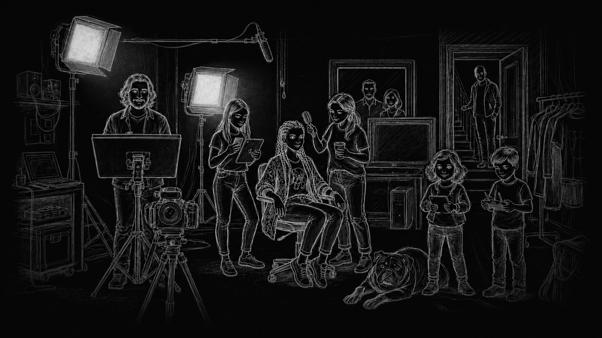

# GNVIC

### Generador de narrativas visuales interactivas y críticas

*La imagen no solo ilustra el pensamiento: le da forma.*

 

---

## Qué es

GNVIC es una plataforma de co-creación de narrativas visuales secuenciales (novela gráfica, cómic, manga) concebida como un artefacto epistémico: un dispositivo en el que una posición teórica se traduce en forma narrativa. Continúa la iniciativa VIZIO, que exploró una premisa sencilla y potente, la de que la imagen sirve para pensar, y la lleva un paso más allá: aquí la imagen no acompaña al argumento, lo instancia.

El proyecto se desarrolla en el marco de Artefactos epistémicos, del Departamento de Ciencias Sociales y Políticas de la Universidad Iberoamericana Ciudad de México.

---

## La premisa

GNVIC tiende un puente entre la teoría académica y la ficción narrativa. Su propósito es permitir la construcción de secuencias breves en las que las ideas abstractas adquieren cuerpo, tensión y conflicto. A través del relato y de la representación visual, las categorías analíticas dejan de enunciarse para dramatizarse: la teoría no se explica, se habita.

Así, el artefacto funciona como un laboratorio de ideas, un espacio donde una perspectiva teórica (filosófica, sociológica, política, de género u otra) viaja oculta bajo la superficie de la historia y se revela solo al final, como antesala de una discusión fundamentada.

---

## Cómo funciona

GNVIC se organiza en tres niveles.

**1. El artefacto (el marco).** Se define el género, el estilo y el título de la pieza, y sobre todo su subtexto: la perspectiva teórica y el debate conceptual que permanecerán en segundo plano. La trama general orienta la creación sin descubrir lo que cifra. Quien define este marco trabaja con dos caras, una dramática y visible, y otra teórica y deliberadamente velada.

**2. El episodio (la creación).** Dentro de ese marco, la persona usuaria construye un episodio: le da nombre y autoría, escribe su propia trama, elige los personajes participantes de una galería y decide su extensión (cuatro, seis u ocho viñetas).

**3. El producto y la develación (el cierre).** En la mesa de luz se componen y ajustan las viñetas, con un modo teatro para la lectura. Al concluir, el botón de develación descubre el subtexto teórico que la narrativa había cifrado y compone el cierre epistémico. El resultado puede exportarse como documento PDF, con portada, y como referencia bibliográfica en formato RIS.

---

## Un gesto de lectura

La pantalla de inicio incluye una lupa interactiva que, al recorrer la imagen, descubre el texto que late debajo de ella. Es un pequeño gesto de método: leer una imagen es buscar lo que afirma sin decirlo, atender a que cada parte de una imagen contribuye a su afirmación total.

---

## Características del prototipo

- Gestión de múltiples artefactos y de sus episodios, con persistencia local en el navegador.
- Galería de personajes participantes, seleccionables por episodio.
- Mesa de luz para componer las viñetas, con modo teatro de lectura.
- Generación de portada e imágenes mediante modelos configurables.
- Develación del subtexto con un cierre epistémico animado.
- Exportación del episodio a PDF y de su referencia a formato RIS.

---

## Configuración (BYOK)

El prototipo opera bajo el esquema "trae tu propia llave" (BYOK, por sus siglas en inglés). Requiere una clave de OpenRouter que se almacena únicamente en el navegador de la persona usuaria; desde la configuración pueden elegirse el modelo de texto y el de imágenes, consultar el catálogo disponible y revisar su costo.

> La clave nunca se envía ni se conserva fuera del navegador. La hoja de ruta del proyecto contempla, más adelante, alojar los modelos en infraestructura institucional.

---

## Tecnologías

| Capa | Herramienta |
|------|-------------|
| Estructura e interfaz | HTML, CSS y JavaScript (sin framework) |
| Tipografía | Inter |
| Exportación | jsPDF y html2canvas |
| Modelos de IA | OpenRouter (configurable por la persona usuaria) |
| Persistencia | Almacenamiento local del navegador |

---

## Estado del prototipo

Esta es una versión de prototipo en desarrollo activo. Algunas funciones son experimentales y su comportamiento depende de los modelos que cada persona configure. No constituye todavía una versión final, y tanto la interfaz como el flujo de trabajo pueden cambiar conforme avance la investigación.

---

## Marco institucional y autoría

Proyecto de **Teresa Márquez**, Departamento de Ciencias Sociales y Políticas de la Universidad Iberoamericana Ciudad de México, desarrollado en Techiholic Labs.

🔗 [techiholic.netlify.app](https://techiholic.netlify.app/) · [GitHub @tmarquez-mx](https://github.com/tmarquez-mx)

---

## Licencia

Por definir conforme avance el proyecto.

*Un espacio donde la teoría no se enuncia, se narra.*

